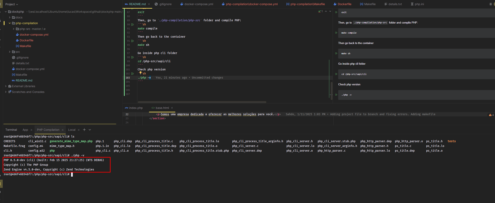

# Lesson Challenge 01

## Setting Up a Project  
Set up the project in the `./src` folder.

To run the project:
```sh
docker compose up -d
```

To execute a command in the container:
```sh
docker compose exec dockphp [your command here]
```

Record the information in a `details.txt` file:

1. Identify the PHP and Zend Engine version.
2. List the installed extensions.
3. Locate the `php.ini` file inside the container.
4. Replace the internal `php.ini` file with a new one using a volume.
5. Set the default PHP timezone to `America/Sao_Paulo`.
6. Increase the PHP memory limit to 512MB.
7. Fix the project display error.

## Personal Challenge (Not to be Submitted)
1. Find out the version of the `pdo_sqlite` extension.
2. Compile PHP using the process demonstrated in class.

Two suggestions:
- Create a Docker Ubuntu image and compile as shown in class.
- Create a VM (using VirtualBox) and compile PHP in the system.

Note: The steps are outlined in the [README](README.md).

## Happy Learning!


---

## Developer Notes

I found the following error:


The code was indeed retrieving the wrong value:


I fixed the error by changing the `index.php` file:


The code now retrieves the correct value:'


# Compiling PHP

## Setting Up a Project  
Go to `./php-compilation` folder.

Inside this folder we have a specific docker setup

To run the project:
```sh
make up
```

Make up should download the php source from git, but for some reason I was not able to do that. So I had to do it manually.

I think the RUN command that tries to download the source do not eep the files inside the container. This is probably a docker issue. But I'm sure this is possible to fix.

So here it is the manual process:

To get inside the container
```sh
make sh
```
After that download php from source:
```sh
git clone https://github.com/php/php-src.git
```
Exit the container
```sh
exit
```
Then, go to `./php-compilation/php-src` folder and compile PHP:
```sh
make compile
```
Then go back to the container
```sh
make sh
```
Go inside php cli folder
```sh
cd /php-src/sapi/cli
```
Check php version
```sh
./php -v
```
You will see something like this:


For checking the pdo_sqlite version, exit the container and then you can run the following command:
```sh
make check-pdo-sqlite-version
```
The result will be something like this:


